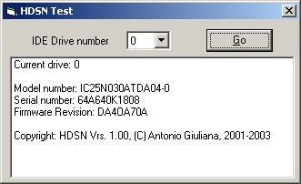



## HDSN \- Hard Disk Serial Number \- Get physical info from IDE Hard Disk

### Description

The library get physical information (Model Number, Serial Number and Firmware Revision) of the IDE Hard disk (unit from 0 to 3) SMART compliant
 
### More Info
 
Drive number property (physical IDE Hard disk 0 to 3)

Installation:

- Copy HDSNLib.DLL into \WINDOWS\SYSTEM (Win9X) or \WINNT\SYSTEM32 (NT/2000)

- DLL registration - from cmd/command with REGSVR32 tool

- Only for Win9X : move file SMARTVSD.VXD from \WINDOWS\SYSTEM folder to \WINDOWS\SYSTEM\IOSUBSYS folder and restart

Original code published on www.visual-basic.it

Model number

Serial number

Firmware revision

             |
---                |---
**Submitted On**   |2003-01-17 08:25:08
**By**             |[Antonio Giuliana](https://github.com/Planet-Source-Code/PSCIndex/blob/master/ByAuthor/antonio-giuliana.md)
**Level**          |Advanced
**User Rating**    |4.8 (76 globes from 16 users)
**Compatibility**  |VB 5\.0, VB 6\.0
**Category**       |[Libraries](https://github.com/Planet-Source-Code/PSCIndex/blob/master/ByCategory/libraries__1-49.md)
**World**          |[Visual Basic](https://github.com/Planet-Source-Code/PSCIndex/blob/master/ByWorld/visual-basic.md)
**Archive File**   |[HDSN\_\-\_Har1530281172003\.zip](https://github.com/Planet-Source-Code/antonio-giuliana-hdsn-hard-disk-serial-number-get-physical-info-from-ide-hard-disk__1-42494/archive/master.zip)

